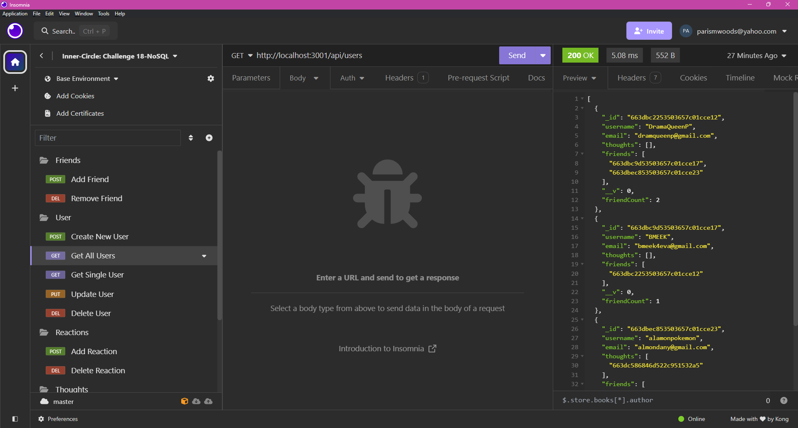
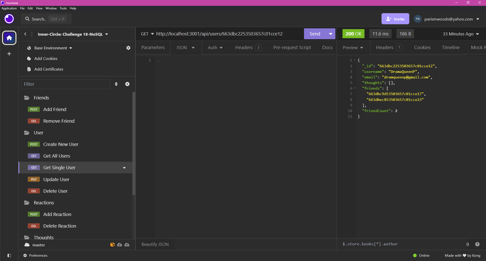
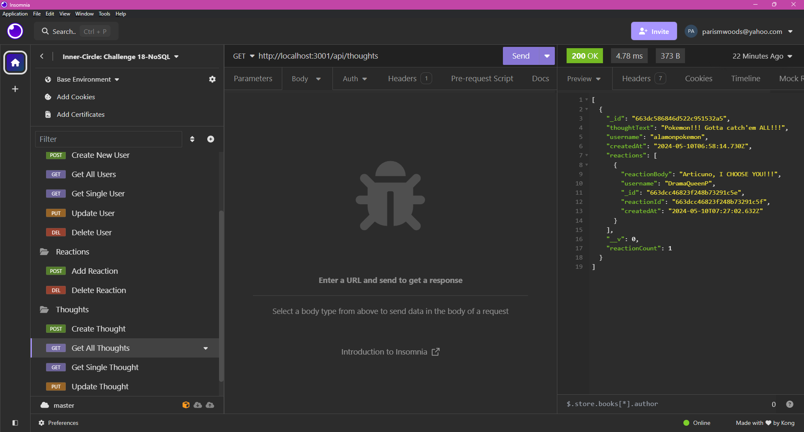
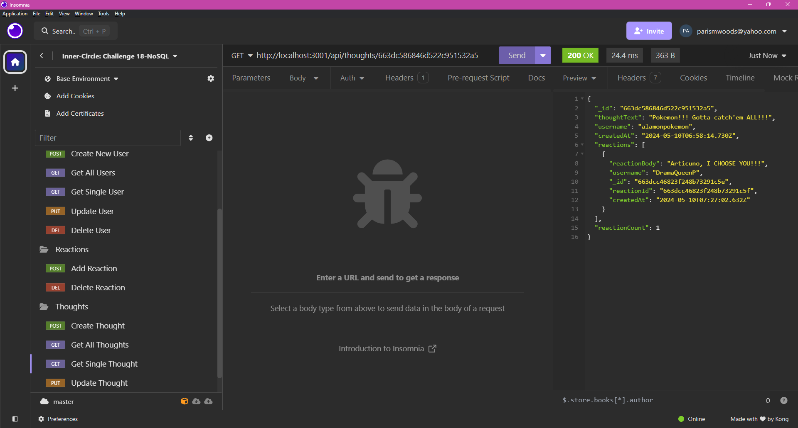
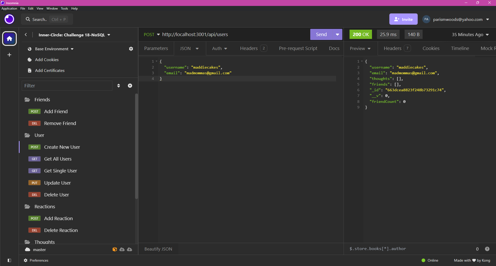

# Inner-Circle
A social media startup that uses a NoSQL database.

## Description
Inner Circle is a social media startup that uses a NoSQL database and allows users to create a friends list, create random thoughts, and react. The application keeps count of the number of friends, thoughts and reactions per user allowing for more individual organization. 

## Installation Requirements
This application requires the use of express and mongoose.

## Usage
Using the GET, POST, PUT, and DELETE routes within Insomnia, users can create and access user data within the application. Simply start by creating a user, with a username and email address. Email address is validated using standard regular expression for email. After creating a user, create a thought from that user using “thoughtText,” username, and “userId.” When more users and thoughts are created, add friends, or reactions to each user using the “userId” or “thoughtId”. 

### Link to Video
https://drive.google.com/file/d/1ItfTN8LeHWV1N0dRCHRjm-zTFcNXntV4/view?usp=sharing

### Screenshots
Getting All Users:

Getting a single user:

Getting All Thoughts:

Getting a single thought:

Creating a new User:

Creating a new Thought:

